# Infrastucture as code

Where we codify everything, such as user stories. This is implementing the stories into code. Another example, is the bash script we made to install nginx, we want to be able to reuse this possibly for 100s of times. I can be hybrid, local or on the cloud. I am going to be using AWS for this task.

Other ways to use it: Chef, puppet. I am using Ansible.

## What is Ansible?

This is the configuration management tool used heavily in DevOps. It is simple to use. It is agentless, lightweight, doesnt have dependencies. Setting up the controller (master node) and other things.

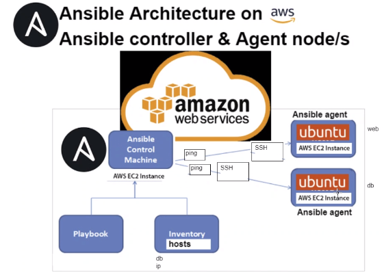

### Steps to set up ansible with app, db and controller

1. Create 2 EC instances with ubuntu 18.04 and security group SSH ami-0a7493ba2bc35c1e9
2. Name controller, db and app
3. SSH into the controller vm
4. update - `sudo apt update -y`
5. install common software 

`sudo apt-get install software-properties-common`

6. Add a repo for ansible

`sudo apt-add-repository ppa:ansible/ansible`

7. update again `sudo apt update -y`
8.  Install ansible `sudo apt install ansible -y`

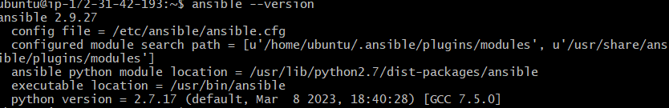

9. SSH into app and db vms and update and upgrade
10. SSH back into controller (agent node)
11. cd into ansible folder `cd /etc/ansible/` to check if ansible is there and available
12. Add tech241.pem file to .ssh folder (copy it from local)
13. Give it correct permissions `sudo chmod 400 tech241.pem` (just read permissions)
14. In the controller vm - ssh into the app vm and the db vm to test the connection and see if it works
15. back in the controller cd into ansible location `cd /etc/ansible/`


16. Install tree `sudo apt install tree -y` for a better view
17. ansible ping command `sudo ansible all -m ping` - doesnt work yet as host file is empty, -m stands for module

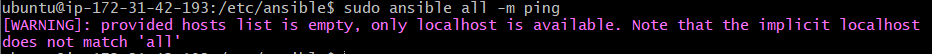

18. `sudo nano hosts`

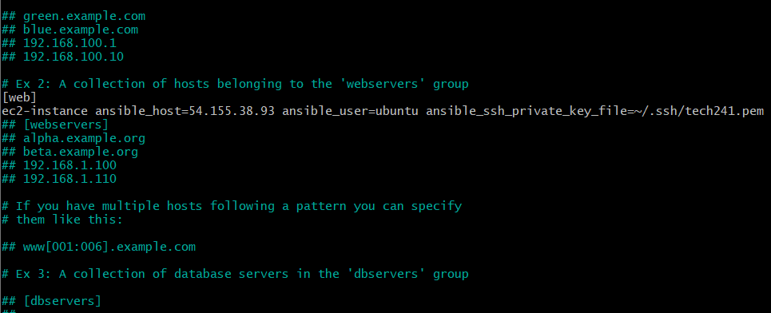

Addition in to the hosts file:

    [web]
    ec2-instance ansible_host=54.155.38.93 ansible_user=ubuntu ansible_ssh_private_key_file=~/.ssh/tech241.pem

The ansible_host is the public app ip address.

19.  Run `sudo ansible web -m ping`
    
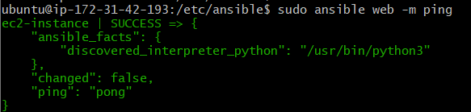

Remember that in AWS the public ip address changes so you have to go back into the hosts file when you restart the vms and change the ip addresses:

controller ip: 3.248.248.187
app ip: 3.249.252.35
db ip: 3.249.221.80

Before you can do an update you need to find out the operating system of the node as the different OS have different commands. adhoc commands are used for this. So you dont need to ssh into every instance. It needs sudo permissions for ansible. [Link to adhoc command page](https://docs.ansible.com/ansible/latest/command_guide/intro_adhoc.html)

Example:

`sudo ansible web -a "uname -a"` : -a is argument, this will guve us the os of the web vm. It will first ping to chack if it is running, then it will check if it has access using ssh.

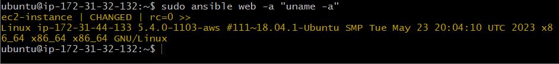

`sudo ansible web -a "date"` : Used to check where the vm is running as they can be all over the world - important is different regions have different weekends and times.

`sudo ansible web -a "free"` : how much memory is availble. Important if you need to install things and you need to see if there is enough space

`sudo ansible web -a "la -l"` : checks to see if it has the correct files and dependencies

Find an adhoc command to transfer file from controller to agent.

`sudo ansible web -m ansible.builtin.copy -a "src=~/test.txt dest=~"`
`sudo ansible web -a "cat test.txt"`

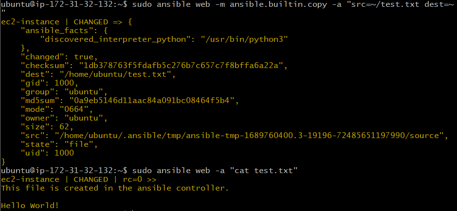

End goal for today is to get ansible to install and configure things in the app and db vms. 

For the web vm:

- Install nginx
- Node security group must allow port 80 and port 22 (this is done in the aws portal security group)

### Write a playbook using Yaml

`cd /etc/ansible`
`sudo nano nginx-playbook.yml`

Lots of devops tools use yaml including ansible. Playbooks are reusable and can be used on as many nodes as you would like.
A yml file always starts with 3 dashes ---.

Indentation is key, dont use tab!

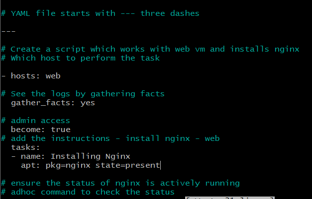

`sudo ansible-playbook nginx-playbook.yml` : Runs the playbook
`sudo ansible web -a "systemctl status nginx"` : Checks if nginx is running in the web

#### Creating a playbook for node:

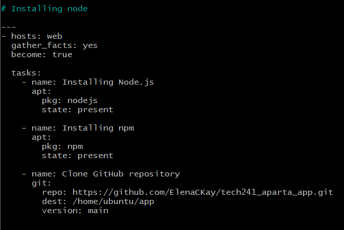

This installs node to the web vm and git clones the app folder to the vm. I still need to work out how to do the npm install and npm start.


#### Playbook with node and npm:

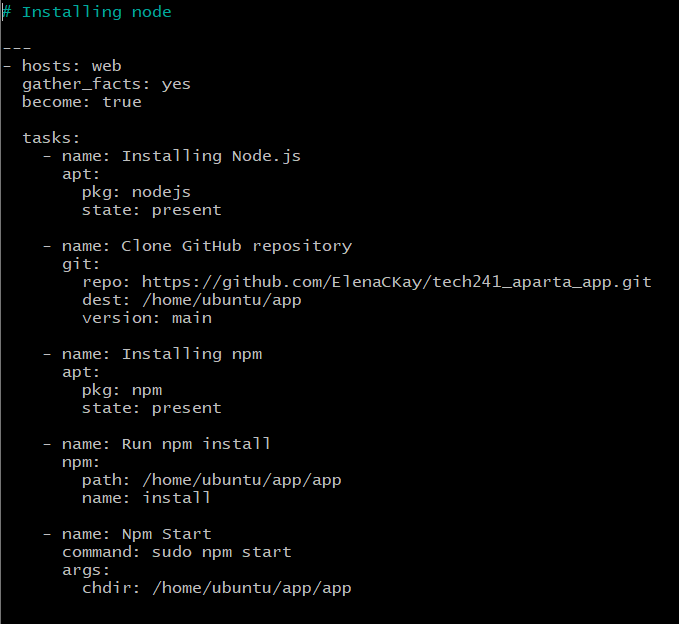

This will run the app but because there is no pm2 you cant do anything in the terminal as it runs.

```
---
- hosts: web
  gather_facts: yes
  become: true

  tasks:
    - name: Installing Node.js
      apt:
        pkg: nodejs
        state: present

    - name: Clone GitHub repository
      git:
        repo: https://github.com/ElenaCKay/tech241_aparta_app.git
        dest: /home/ubuntu/app
        version: main

    - name: Installing npm
      apt:
        pkg: npm
        state: present

    - name: Run npm install
      npm:
        path: /home/ubuntu/app/app
        name: install

    - name: Npm Start
      command: sudo npm start
      args:
        chdir: /home/ubuntu/app/app

```

#### Got it working with pm2:

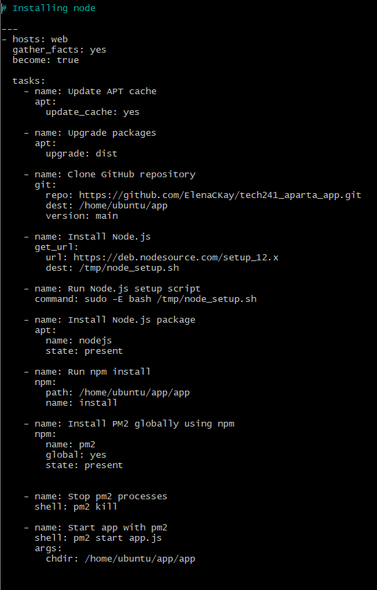

```---
- hosts: web
  gather_facts: yes
  become: true

  tasks:
    - name: Update APT cache
      apt:
        update_cache: yes

    - name: Upgrade packages
      apt:
        upgrade: dist

    - name: Clone GitHub repository
      git:
        repo: https://github.com/ElenaCKay/tech241_aparta_app.git
        dest: /home/ubuntu/app
        version: main

    - name: Install Node.js
      get_url:
        url: https://deb.nodesource.com/setup_12.x
        dest: /tmp/node_setup.sh

    - name: Run Node.js setup script
      command: sudo -E bash /tmp/node_setup.sh

    - name: Install Node.js package
      apt:
        name: nodejs
        state: present

    - name: Run npm install
      npm:
        path: /home/ubuntu/app/app
        name: install

    - name: Install PM2 globally using npm
      npm:
        name: pm2
        global: yes
        state: present


    - name: Stop pm2 processes
      shell: pm2 kill

    - name: Start app with pm2
      shell: pm2 start app.js
      args:
        chdir: /home/ubuntu/app/app
```

## Orchestration with Terraform

Not using AWS cloud formation as this could then only be used on AWS. It is cloud dependent. Terraform is cloud independant and so it can be used on any cloud, local or hybrid. 